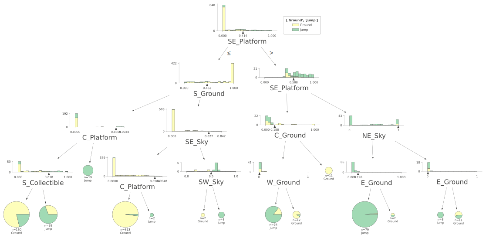

Source code for the paper:

# On explainability of reinforcement learning-based machine learning agents trained with Proximal Policy Optimization that utilizes visual sensor data

Author: [Tomasz Hachaj](https://home.agh.edu.pl/~thachaj/), Marcin Piekarczyk

## Abstract

In this paper, we will address the issues of the explainability of reinforcement learning-based machine learning agents trained with Proximal Policy Optimization (PPO) that utilizes visual sensor data. We will propose an algorithm that allow an effective and intuitive approximation of the PPO-trained neural network (NN). We will also conduct several experiments to confirm our method's effectiveness. Our proposed method works well for scenarios where semantic clustering of the scene is possible. It is based on the solid theoretical foundation of the Gradient-weighted Class Activation Mapping (GradCAM) and Classification And Regression Tree with additional proxy geometry heuristics. It excelled in the explanation process in a virtual simulation system based on a video system with relatively low resolution. Depending on the convolutional features extractor of the PPO-trained neural network, our method obtained 0.945 to 0.968 accuracy of approximation of the black-box model. We have published all source codes so our experiments can be reproduced.

## Requirements

For Ml Agents training:
- Unity engine 2021.3.18f1 or any other that supports Ml Agents 2.0.1
- Ml Agents 2.0.1 
- Python 3.9
- Torch 2.2.2
- Tensorboard 2.17.1
- mlagents 0.30.0
- mlagents-envs 0.30.0
- gym 0.26.2

For model explanation:
- 3.10
- tensorflow 2.8
- keras 2.8
- scikit-learn 1.5.2
- onnx 1.14.1
- onnx2kears 0.0.24 [link](https://github.com/gmalivenko/onnx2keras)

## How to run

Before you execute any project or script, double-check local paths in the source codes!

1. Design and train your agent in Unity (see example project [MLAgentReinforcementLearning](MLAgentReinforcementLearning)),
2. Generate input images and semantic classifications (see example project [MLAgentReinforcementLearning](MLAgentReinforcementLearning)). Example data is in directory [data](data),
3. Modify the ONNX brain of the Aegnt using, for example, [onnx-modifier](https://github.com/ZhangGe6/onnx-modifier), remove the softmax layer, and leave only image input and classification outputs. Example brains are in directory [brains](brains),
4. Transform the ONNX model to Keras using [export_to_keras.py](export_to_keras.py),
5. Visualize GradCAM [gradcam_keras_from_image.py](gradcam_keras_from_image.py), you can also generate images for visualization (see examples in [Example results](#example-results)),
6. Generate data for explanation [gradcam_keras_generate_features_loop_multi_inputs.py](gradcam_keras_generate_features_loop_multi_inputs.py),
7. Perform explanation with CART [CARTVisualization.ipynb](CARTVisualization.ipynb), use txt files generated in the previous step (see example [data file](data/Nature/128x128_hidden16_power=1_threshold=0.1_1000.txtfb.txt)), we run this script on Google Colab.

Optionally, you can generate latex tables from evaluation results using the script [GenerateTables.R](GenerateTables.R)

## Example results

Example visualizations of GradCAM for agents with various resolutions of camera: 
- $48 \times 48 $ 
- $64 \times 64 $ 
- $96 \times 96 $ 
- $128 \times 128 $ 
- $192 \times 192 $

### "Simple" convolutional neural network

<!--

-->

<!--<video src="data/Simple/SimpleCollector_48x48_hidden16.mp4 " width="320" height="240" controls></video>
<video src="data/Simple/SimpleCollector_64x64_hidden16.mp4 " width="320" height="240" controls></video>
<video src="data/Simple/SimpleCollector_96x96_hidden16.mp4 " width="320" height="240" controls></video>
<video src="data/Simple/SimpleCollector_128x128_hidden16.mp4 " width="320" height="240" controls></video>
<video src="data/Simple/SimpleCollector_192x192_hidden16.mp4 " width="320" height="240" controls></video>-->

### "Nature" convolutional neural network

<!--

-->

<!--<video src="data/Nature/SimpleCollector_48x48_hidden16.mp4 " width="320" height="240" controls></video>
<video src="data/Nature/SimpleCollector_64x64_hidden16.mp4 " width="320" height="240" controls></video>
<video src="data/Nature/SimpleCollector_96x96_hidden16.mp4 " width="320" height="240" controls></video>
<video src="data/Nature/SimpleCollector_128x128_hidden16.mp4 " width="320" height="240" controls></video>
<video src="data/Nature/SimpleCollector_192x192_hidden16.mp4 " width="320" height="240" controls></video>-->

Example CART-based explanation of ML Agent brain for 192x192 input video stream, "Simple" convolutional NN, $ ( \alpha=2, t=0.1 ) $ for Front-Back action. The depth of tree was set to 4.

Example CART-based explanation of ML Agent brain for 192x192 input video stream, "Simple" convolutional NN, $ ( \alpha=2, t=0.1 ) $ for Left-Right action. The depth of tree was set to 4.

Example CART-based explanation of ML Agent brain for 192x192 input video stream, "Simple" convolutional NN, $ ( \alpha=2, t=0.1 ) $ for Jump action. The depth of tree was set to 4.

<!-- Full text -->

<!-- Cite as -->